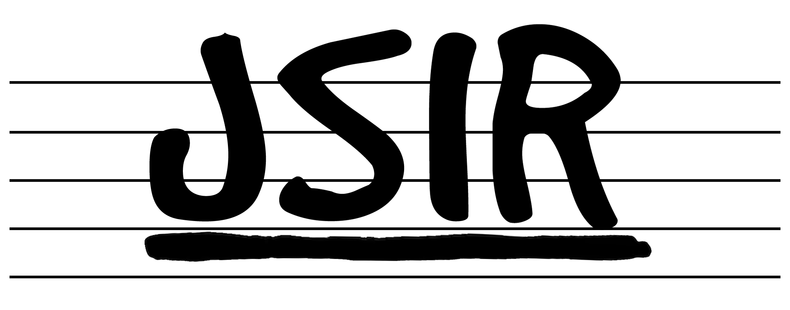
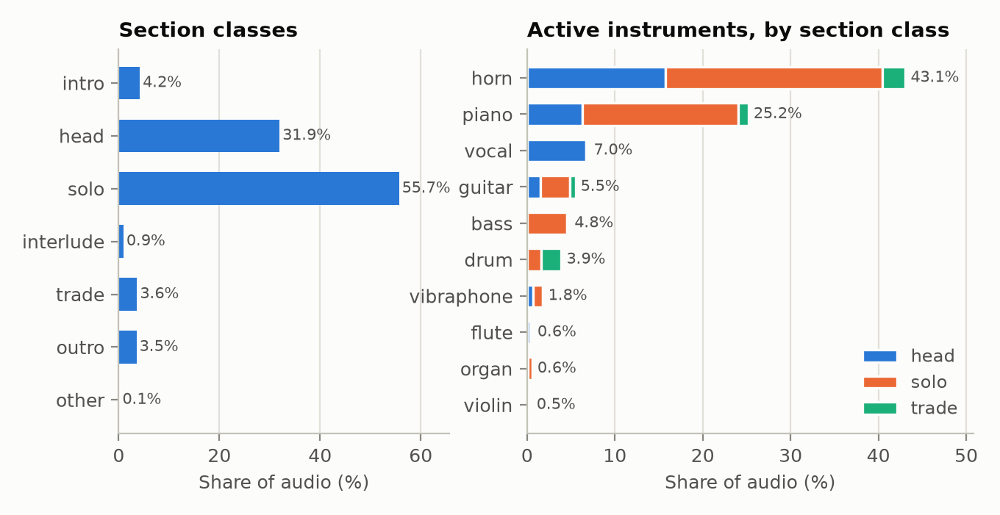

    
    <h1>JSIR: An Audio-Aligned, Multi-Task Dataset of Jazz Standard Recordings</h1>
    
Sihun Lee, Dasaem Jeong

    

        <a target="_blank" href="https://jsir-browser.onrender.com">Dataset Browser</a>
         · 
        <a target="_blank" href="https://github.com/MALerLab/JSIR-annotator">Annotation Tool</a>
    

---

JSIR (**J**azz **S**tandards dataset for **I**nformation **R**etrieval) provides beat and downbeat, chord, and structure annotations for 267 jazz recordings, spanning 25.6 hours of audio. It features four to nine recording versions for each jazz standard.

The repertoire spans a wide variety of styles and settings: from the Great American Songbook classics to hard-bop tunes, and from small combos to big band arrangements. Recordings were selected mainly for prominence and adherence to the "canonical" chord changes. All annotations were produced by the [main author](https://issyun.net) who is a jazz musician and throughly revised in several passes.

## Dataset Structure
The three layers of annotation (beats, chord, and structure) are aligned to the same beat grid, so that all events coincide with a beat.
- `beats/`: Beat and downbeat positions are given for each recording as a plain text file. Downbeats are marked with an additional `1` separated by tabs.
- `chords/`: Chord events are given as CSV files, listing onset timings and chord names in shorthand Harte syntax.
- `structure/`: Musical structure events are given as CSV files. Names for sections are structured in a six-class taxomony: `intro`, `head`, `solo`, `interlude`, `trade`, and `outro`. For head and solo sections, an additional label denotes the prominent active instruments, separated by a colon; e.g. `head:piano`, `solo:bass`, `trade:horn,drum`.
- `segments/`: The segment labels mark regions where beat and chord information can be deemed reliable enough; it excludes unaccompanied solos, rubato intros, solos with ambiguous timing or harmony, etc. **Data for beat tracking and chord estimation should only be sampled from the valid segment regions.**
- `audio/`: The collected WAV audio files are to be put here, named as `{youtube_id}.wav`.
- `lead_sheets.json` provides high-level information and the chord progression for each standard.
- `metadata.json` provides further details for individual recordings, including MusicBrainz and YouTube IDs that pin down the exact version.

## Tools
- [JSIR Browser](https://jsir-browser.onrender.com) is a web app for browsing the dataset's contents alongside audio. When visiting the website, please expect up to ~50 seconds of warmup as the hosting provider puts the app under hibernation with inactivity.
- [JSIR Annotator](https://github.com/MALerLab/JSIR-annotator) is the annotation tool purpose-built for JSIR, which features functionalities for metadata and audio collection and convenient DAW-like labeling.

## Contributing
We welcome outside contributors who may want to revise the annotations or add new data. We encourage contributors to use the JSIR Annotator when editing or creating labels as it makes the process delightfully conveinent.

## License
JSIR annotations are released under [CC BY-SA 4.0](https://creativecommons.org/licenses/by-sa/4.0/). Users are free to distribute, remix, adapt, and build upon the dataset in any medium or format, so long as attribution is given to the original authors. Derivitive material should also be released under the same license.

## Statistics
We include some detailed dataset statistics (not covered in the paper due to page constraints) below.

### Overview

| Quantity | Value |
| :-- | --: |
| Recordings | 267 |
| Jazz standards | 44 |
| Recordings per standard | 4–9 (mean 6.1) |
| Distinct artist credits | 173 |
| Total audio | 25h 38m (25.65 h) |
| Mean / median recording length | 5:46 / 4:59 |
| Beats annotated | 260,328 (233,015 inside valid segments) |
| Downbeats (bars) annotated | 65,296 (58,442 inside valid segments) |
| Chord events | 73,006 (67,751 inside valid segments) |
| Structure sections | 1,434 (mean 5.4 per recording) |
| Mean tempo | 181.4 BPM |

### Tempo Stability

| Statistic | Value |
| :-- | --: |
| Median tempo drift | +0.0% |
| Mean tempo drift | +1.7% |
| Recordings speeding up by more than 2% | 111 (41.6%) |
| Recordings slowing down by more than 2% | 62 (23.2%) |

### Chords

**Chord Qualities**, grouped into families:

| Family | Qualities | Events | Share of events | Audio (valid) | Share of audio |
| :-- | :-- | --: | --: | --: | --: |
| dominant | `7`, `9` | 28,944 | 39.6% | 7h 36m | 36.7% |
| minor | `min`, `min7`, `min6`, `minmaj7` | 24,495 | 33.6% | 6h 31m | 31.5% |
| major | `maj`, `maj7`, `maj6` | 14,456 | 19.8% | 4h 35m | 22.2% |
| half-diminished | `hdim7` | 3,249 | 4.5% | 50m 14s | 4.0% |
| diminished | `dim`, `dim7` | 556 | 0.8% | 9m 55s | 0.8% |
| suspended | `sus4` | 774 | 1.1% | 24m 25s | 2.0% |
| augmented | `aug` | 207 | 0.3% | 4m 26s | 0.4% |
| no chord | `N` | 325 | 0.4% | 29m 38s | 2.4% |

**Root degrees**, relative to the tonic of each recording:

| Degree above tonic | Events | Share | Share (major keys) | Share (minor keys) |
| :-- | --: | --: | --: | --: |
| I | 11,369 | 15.6% | 23.8% | 47.8% |
| bII | 2,688 | 3.7% | 1.4% | 12.7% |
| II | 10,114 | 13.9% | 16.7% | 6.1% |
| bIII | 5,701 | 7.8% | 2.8% | 4.7% |
| III | 2,089 | 2.9% | 8.9% | 0.0% |
| IV | 11,292 | 15.5% | 8.5% | 5.8% |
| bV | 1,795 | 2.5% | 2.1% | 0.0% |
| V | 10,192 | 14.0% | 14.6% | 14.8% |
| bVI | 2,935 | 4.0% | 2.7% | 2.4% |
| VI | 4,705 | 6.5% | 10.8% | 1.2% |
| bVII | 8,085 | 11.1% | 4.2% | 4.3% |
| VII | 1,716 | 2.4% | 3.6% | 0.1% |

**Most frequent chord transition types**. The last column gives the usual functional reading:

| From | Root motion | To | Transitions | Share | Common reading |
| :-- | :-- | :-- | --: | --: | :-- |
| `min7` | up P4 | `7` | 10,415 | 14.4% | ii–V |
| `7` | up P4 | `maj7` | 6,488 | 9.0% | V–I |
| `7` | up P4 | `min7` | 4,063 | 5.6% | V–i, or V→ii of a ii–V chain |
| `7` | up P4 | `7` | 3,697 | 5.1% | dominant chain (e.g. blues I7–IV7) |
| `hdim7` | up P4 | `7` | 2,997 | 4.2% | iiø–V |
| `7` | up P4 | `min` | 1,341 | 1.9% | V–i |
| `7` | up P4 | `maj6` | 1,206 | 1.7% | V–I |
| `7` | up P5 | `7` | 1,148 | 1.6% |  |
| `min7` | up P4 | `min7` | 1,053 | 1.5% | chain of minor sevenths (e.g. iii–vi) |
| `7` | up M7 | `7` | 851 | 1.2% | dominant chain, descending |
| `maj7` | same root | `min7` | 843 | 1.2% |  |
| `7` | same root | `min7` | 832 | 1.2% |  |

### Structure

**Occurrence of structure event types**:

| Section class | Sections | Share | Recordings | Audio | Audio Share | Mean length | Mean bars |
| :-- | --: | --: | --: | --: | --: | --: | --: |
| `intro` | 184 | 12.8% | 184 | 1h 02m | 4.2% | 0:20 | 8.2 |
| `head` | 494 | 34.4% | 256 | 7h 57m | 31.9% | 0:58 | 33.5 |
| `solo` | 581 | 40.5% | 234 | 13h 52m | 55.7% | 1:26 | 69.9 |
| `interlude` | 34 | 2.4% | 27 | 13m 55s | 0.9% | 0:25 | 17.2 |
| `trade` | 51 | 3.6% | 50 | 54m 23s | 3.6% | 1:04 | 59.9 |
| `outro` | 89 | 6.2% | 89 | 52m 47s | 3.5% | 0:36 | 14.9 |

**Solo instrument shares**:

| Soloist | Solo sections | Solo audio | Share of solo audio | Mean solo length | Mean bars per solo |
| :-- | --: | --: | --: | --: | --: |
| `horn` | 252 | 6h 19m | 45.6% | 1:30 | 73.7 |
| `piano` | 172 | 4h 32m | 32.7% | 1:35 | 79.7 |
| `bass` | 64 | 1h 10m | 8.4% | 1:06 | 49.1 |
| `guitar` | 40 | 51m 07s | 6.1% | 1:17 | 71.1 |
| `drum` | 25 | 24m 37s | 3.0% | 0:59 | 24.7 |
| `vibraphone` | 13 | 16m 41s | 2.0% | 1:17 | 60.7 |
| `organ` | 5 | 7m 45s | 0.9% | 1:33 | 94.4 |
| `violin` | 5 | 3m 59s | 0.5% | 0:48 | 30.8 |
| `vocal` | 2 | 2m 33s | 0.3% | 1:17 | 48.0 |
| `flute` | 2 | 2m 09s | 0.3% | 1:04 | 48.0 |
| `percussion` | 2 | 2m 00s | 0.2% | 1:00 | 62.5 |
| `clarinet` | 2 | 1m 29s | 0.2% | 0:45 | 50.0 |

### Repertoire

**Jazz Standards Covered**:

| Standard | Composer | Recordings | Key | Bars | Tempo class | Feel | Tonality | Audio | BPM range |
| :-- | :-- | --: | :-- | --: | :-- | :-- | :-- | --: | --: |
| Airegin | Sonny Rollins | 8 | Ab maj | 36 | Up | Swing | functional | 49m 04s | 235–316 |
| Alice in Wonderland | Sammy Fain | 6 | C maj | 64 | Medium Up | Jazz Waltz | functional | 41m 16s | 146–218 |
| All the Things You Are | Jerome Kern | 9 | Ab maj | 36 | Up | Swing | functional | 55m 16s | 75–229 |
| Autumn Leaves | Joseph Kosma | 6 | E min | 32 | Medium | Swing | functional | 36m 45s | 62–207 |
| Bags' Groove | Milt Jackson | 7 | F maj | 12 | Medium Up | Swing | blues | 46m 24s | 102–194 |
| Billie's Bounce | Charlie Parker | 7 | F maj | 12 | Medium Up | Swing | blues | 55m 15s | 158–273 |
| Blue Bossa | Kenny Dorham | 7 | C min | 32 | Medium Up | Latin | functional | 47m 38s | 162–293 |
| Bye Bye Blackbird | Ray Henderson | 5 | G maj | 32 | Medium Up | Swing | functional | 32m 23s | 73–171 |
| Caravan | Juan Tizol, Duke Ellington | 7 | F min | 64 | Up | Swing | modal | 44m 02s | 182–364 |
| Cherokee | Ray Noble | 7 | Bb maj | 64 | Up | Swing | functional | 40m 04s | 250–353 |
| Confirmation | Charlie Parker | 7 | F maj | 32 | Up | Swing | functional | 47m 11s | 162–267 |
| Desafinado | Antônio Carlos Jobim | 7 | F maj | 68 | Medium Up | Latin | functional | 34m 48s | 118–200 |
| Don't Get Around Much Anymore | Duke Ellington | 8 | C maj | 32 | Up | Swing | functional | 26m 31s | 80–111 |
| Donna Lee | Charlie Parker, Miles Davis | 6 | Ab maj | 32 | Up | Swing | functional | 32m 15s | 226–324 |
| Embraceable You | George Gershwin | 5 | G maj | 32 | Slow | Swing | functional | 19m 18s | 60–72 |
| Giant Steps | John Coltrane | 5 | Eb maj | 16 | Up | Swing | functional | 56m 17s | 250–300 |
| Honeysuckle Rose | Fats Waller | 6 | F maj | 32 | Up | Swing | functional | 18m 22s | 171–218 |
| Hot House | Tadd Dameron | 5 | C maj | 32 | Medium Up | Swing | functional | 35m 46s | 188–293 |
| I Can't Get Started | Vernon Duke | 7 | C maj | 32 | Medium Slow | Swing | functional | 34m 53s | 58–98 |
| I Got Rhythm | George Gershwin | 5 | Bb maj | 32 | Up | Swing | functional | 19m 36s | 214–308 |
| I Mean You | Coleman Hawkins, Thelonious Monk | 7 | F maj | 32 | Up | Swing | functional | 44m 00s | 150–255 |
| I'll Remember April | Gene de Paul | 6 | G maj | 48 | Up | Swing | functional | 52m 29s | 214–299 |
| Impressions | John Coltrane | 6 | D min | 32 | Up | Swing | modal | 42m 34s | 267–308 |
| Joy Spring | Clifford Brown | 5 | F maj | 32 | Medium Up | Swing | functional | 33m 30s | 150–200 |
| Just Friends | John Klenner | 6 | G maj | 32 | Up | Swing | functional | 29m 16s | 74–279 |
| Lullaby Of Birdland | George David Weiss, George Shearing | 6 | F min | 32 | Medium | Swing | functional | 21m 59s | 111–194 |
| Maiden Voyage | Herbie Hancock | 4 | – | 32 | Medium | Straight | modal | 24m 09s | 113–130 |
| Milestones | Miles Davis | 4 | F maj | 40 | Up | Swing | modal | 21m 18s | 231–286 |
| My Funny Valentine | Richard Rodgers | 4 | C min | 36 | Medium | Swing | functional | 14m 44s | 67–72 |
| Oleo | Sonny Rollins | 4 | Bb maj | 32 | Up | Swing | functional | 19m 18s | 226–309 |
| On Green Dolphin Street | Bronisław Kaper | 6 | Eb maj | 32 | Medium Up | Swing | functional | 48m 49s | 158–211 |
| Ornithology | Charlie Parker, Benny Harris | 5 | G maj | 32 | Up | Swing | functional | 19m 20s | 176–250 |
| Perdido | Juan Tizol | 6 | Bb maj | 32 | Medium Up | Swing | functional | 37m 00s | 128–231 |
| Polka Dots And Moonbeams | Jimmy Van Heusen | 7 | F maj | 32 | Slow | Swing | functional | 31m 29s | 48–110 |
| So What | Miles Davis | 7 | D min | 32 | Medium Up | Swing | modal | 56m 58s | 167–261 |
| Sophisticated Lady | Duke Ellington | 5 | Ab maj | 32 | Slow | Swing | functional | 27m 54s | 61–122 |
| St. Thomas | Sonny Rollins | 4 | C maj | 16 | Up | Latin | functional | 25m 04s | 207–273 |
| Star Eyes | Don Raye, Gene de Paul | 8 | Eb maj | 36 | Up | Swing | functional | 42m 08s | 102–194 |
| Summertime | George Gershwin | 4 | G min | 16 | Medium Slow | Swing | functional | 12m 30s | 90–146 |
| There Will Never Be Another You | Harry Warren | 7 | Eb maj | 32 | Medium Up | Swing | functional | 35m 28s | 85–273 |
| Wave | Antônio Carlos Jobim | 7 | D maj | 44 | Medium | Latin | functional | 40m 01s | 140–200 |
| What's New | Bob Haggart | 6 | C maj | 32 | Slow | Swing | functional | 27m 24s | 59–118 |
| Yardbird Suite | Charlie Parker | 7 | C maj | 32 | Up | Swing | functional | 32m 38s | 162–245 |
| Yesterdays | Jerome Kern | 6 | D min | 16 | Medium | Swing | functional | 25m 46s | 64–136 |

**Most frequent recording artists** (123 credits appear only once):

| Artist credit | Recordings |
| :-- | --: |
| Charlie Parker | 7 |
| Miles Davis | 6 |
| Wes Montgomery | 5 |
| Bill Evans Trio | 5 |
| Art Pepper | 5 |
| Dexter Gordon | 4 |
| Oscar Peterson | 4 |
| McCoy Tyner | 4 |
| Ella Fitzgerald | 4 |
| Sarah Vaughan | 4 |
| Billie Holiday | 4 |
| Miles Davis Quintet | 3 |
| Clifford Brown | 3 |
| Frank Sinatra | 3 |
| Coleman Hawkins | 3 |

**Instrumentation**:

| Ensemble | Recordings | Share | Audio |
| :-- | --: | --: | --: |
| trio | 63 | 23.6% | 5h 52m |
| quartet | 63 | 23.6% | 7h 03m |
| quintet | 55 | 20.6% | 6h 07m |
| big band / orchestra / strings | 39 | 14.6% | 2h 31m |
| other / unspecified small group | 27 | 10.1% | 2h 04m |
| sextet to octet | 13 | 4.9% | 1h 27m |
| duo | 5 | 1.9% | 22m 04s |
| solo | 2 | 0.7% | 10m 14s |
